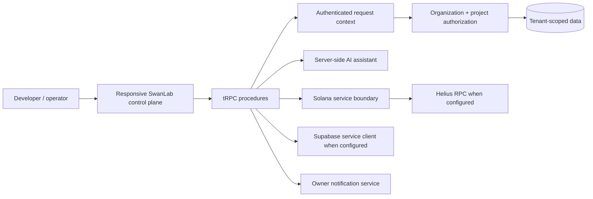

# SwanLab

> **Cloud infrastructure for on-chain businesses.** SwanLab is a tenant-aware control plane for projects that combine cloud data, network services, Solana infrastructure, secure developer access, observability, and AI-assisted operations.

SwanLab is designed for teams that need a coherent workspace rather than a collection of dashboard tabs. An organization owns projects; projects own resources, credentials, webhook endpoints, telemetry, policy records, and audit history. The product deliberately represents unconfigured third-party services as **not configured** instead of presenting fabricated live status.

## Product Positioning

| Domain                          | SwanLab responsibility                                                                    | Current V1 surface                                                                      |
| ------------------------------- | ----------------------------------------------------------------------------------------- | --------------------------------------------------------------------------------------- |
| **Identity & tenancy**          | Enforce organization membership before project actions.                                   | Secure sign-in, workspaces, projects, role-aware server procedures.                     |
| **Cloud database & networking** | Register connection metadata without exposing credentials.                                | Project-scoped database and endpoint registers.                                         |
| **Solana infrastructure**       | Centralize RPC configuration, cluster state, wallet identity, and server-request history. | Solana Kit boundary, guarded Helius RPC test, public wallet connection, request ledger. |
| **Developer platform**          | Issue least-privilege credentials and signed outbound integrations.                       | One-time API-key reveal, revocation, webhook endpoints, audit and delivery views.       |
| **Operations**                  | Aggregate status, usage, and policy data within project boundaries.                       | Monitoring and usage records, alert policies, owner delivery test.                      |
| **AI assistance**               | Provide secure configuration guidance without leaking secrets.                            | Server-side assistant with transparent fallback behavior.                               |

## Implementation Status

The present repository is a **working managed full-stack application** built with React, Vite, Express, tRPC, Drizzle, MySQL-compatible storage, and Tailwind. It includes the provider-boundary packages `@supabase/supabase-js` and `@solana/kit`. The original product target is SvelteKit + Supabase; the service contracts and route map are intentionally documented so the UI/runtime can migrate to a native SvelteKit implementation without redesigning tenancy or integration responsibilities.

> **Important:** Supabase service credentials, Helius RPC access, recurring alert execution, and live telemetry remain disabled until corresponding server-side environment values and production policies are supplied. No secret or service-role key is returned to browser code.

## Architecture



The current data flow is intentionally server-authoritative. Browser state carries selected workspace and project identifiers for user experience only; every read or mutation that accepts those identifiers re-checks membership and project ownership on the server. See [Architecture](docs/architecture.md) for data models and authorization boundaries.

## Repository Layout

```text
client/                    # React workspace shell, routes, and reusable UI
  src/components/          # Project controls, command-ready shell, UI primitives
  src/contexts/            # Authentication and persisted workspace selection
  src/pages/               # Product, documentation, status, and auth surfaces
server/                    # tRPC procedures, integration boundaries, database helpers
  services/                # Supabase, Solana, and AI-safe service boundaries
drizzle/                   # Versioned tenant and operations schema migrations
docs/                      # Architecture, API, and Solana implementation guides
.github/workflows/         # Reproducible CI and deployment-readiness checks
```

## Architecture Principles

SwanLab uses three principles to prevent a control plane from becoming a collection of disconnected features.

| Principle                  | Implementation                                                                                                                                          |
| -------------------------- | ------------------------------------------------------------------------------------------------------------------------------------------------------- |
| **Scope first**            | Organization membership is checked before selecting a project, listing data, issuing credentials, or testing external services.                         |
| **Server holds authority** | Privileged provider clients are created only in `server/services`; browser components receive status and safe metadata, never service-role credentials. |
| **State is explicit**      | `ready`, `pending`, `attention`, and `not configured` are distinct product states. Missing configuration is a valid state, not an exception to hide.    |

## Technology Stack

| Layer               | Current implementation                 | Role in SwanLab                                                                                |
| ------------------- | -------------------------------------- | ---------------------------------------------------------------------------------------------- |
| Application runtime | React 19, Vite, Express 4, TypeScript  | Managed full-stack runtime and responsive control-plane interface.                             |
| Contracts           | tRPC 11, Zod                           | Typed procedures and validated input contracts.                                                |
| Data                | Drizzle ORM, MySQL-compatible database | Organizations, projects, resources, credentials, telemetry, policies, and audit events.        |
| Styling             | Tailwind CSS 4, Radix UI, Lucide       | Accessible, responsive International Typographic Style system.                                 |
| Supabase boundary   | `@supabase/supabase-js`                | Server-only client factory ready for tenant data, Auth, Storage, and Realtime integration. [1] |
| Solana boundary     | `@solana/kit`                          | Centralized modern Solana RPC transport and application infrastructure. [2]                    |
| Helius boundary     | `HELIUS_RPC_URL` configuration         | Guarded enhanced RPC integration and future webhook/data API connection. [3]                   |
| AI                  | Server-side LLM helper                 | Infrastructure guidance with a fallback that does not invent external state.                   |

## V1 Capability Map

| Capability                       | Delivered behavior                                                                                                      | Configuration needed for live provider behavior                        |
| -------------------------------- | ----------------------------------------------------------------------------------------------------------------------- | ---------------------------------------------------------------------- |
| Authentication                   | Secure OAuth-backed application access and protected server procedures.                                                 | Platform session configuration is provided by the managed environment. |
| Organizations & projects         | Create/select workspaces and projects; selection persists locally for convenience.                                      | None.                                                                  |
| Database & networking management | Register scoped resource metadata and operational state.                                                                | Add provider-specific connection validation.                           |
| API keys                         | Create a scoped project key, copy it once, audit it, and revoke it.                                                     | Integrate key verification with downstream services.                   |
| Webhooks                         | Register endpoint metadata and one-time signing secret; inspect delivery history.                                       | Add a delivery worker or provider webhook receiver.                    |
| Solana                           | Store cluster resources, request RPC health, record server-side requests, and connect a public browser wallet identity. | `HELIUS_RPC_URL` and an installed/unlocked compatible wallet.          |
| Monitoring & usage               | Read persisted project summaries and record alert policies.                                                             | Data ingestion from providers and deployed scheduled execution.        |
| Notifications                    | Test project-owner delivery with an audit trail.                                                                        | Publish the service and configure a scheduled alert policy.            |
| AI assistant                     | Server-side assistant with safe fallback responses.                                                                     | Optional model/provider configuration managed by the platform.         |

## Local Development

### Prerequisites

Install Node.js 22+ and pnpm 10+. Create a local database compatible with the configured Drizzle dialect before running persistence flows.

```bash
pnpm install
# Create a local .env from the Environment Variables table below.
pnpm dev
```

The application runs on the port selected by its server process. Do not hard-code a port in integration code.

### Quality Commands

```bash
pnpm check       # strict TypeScript validation
pnpm test        # Vitest unit tests
pnpm build       # client and server production build
pnpm format      # apply Prettier formatting
```

### Database Workflow

Schema changes begin in `drizzle/schema.ts`. Generate migration SQL, review it, and apply it to the database only after confirming it contains no destructive change.

```bash
pnpm drizzle-kit generate
# Review drizzle/NNNN_*.sql
pnpm drizzle-kit migrate
```

## Environment Variables

Create a local `.env` from the following table and populate only the variables required by the service boundaries you intend to activate. The managed project’s production secrets are configured through its secure settings, not committed files.

| Variable                                           | Visibility                    | Purpose                                                            |
| -------------------------------------------------- | ----------------------------- | ------------------------------------------------------------------ |
| `DATABASE_URL`                                     | Server only                   | MySQL-compatible persistence connection.                           |
| `JWT_SECRET`                                       | Server only                   | Session signing secret supplied by the deployment environment.     |
| `SUPABASE_URL`                                     | Server only                   | Supabase project URL.                                              |
| `SUPABASE_SERVICE_ROLE_KEY`                        | **Server only**               | Privileged Supabase client key; never expose as a `VITE_*` value.  |
| `SUPABASE_ANON_KEY`                                | Browser-safe only when needed | Public Supabase client key for a future client-specific use case.  |
| `HELIUS_RPC_URL`                                   | Server only                   | Full Helius RPC endpoint used by the centralized Solana transport. |
| `SOLANA_CLUSTER`                                   | Server only                   | Human-readable cluster label; defaults to `mainnet-beta`.          |
| `BAGS_API_KEY`, `DFLOW_API_KEY`, `METEORA_API_KEY` | Server only                   | Reserved provider slots for future DeFi service adapters.          |

## Provider Adapters and Fallback Behavior

Every external provider is resolved through a server-side boundary. SwanLab does **not** attempt a network call when a required configuration value is unavailable. Instead, it returns an explicit status such as `pending` or `not_configured`, and the UI presents an actionable setup state.

| Provider boundary    | Current guard                                                                                | Future adapter contract                                                 |
| -------------------- | -------------------------------------------------------------------------------------------- | ----------------------------------------------------------------------- |
| Supabase             | `getSupabaseServiceClient()` returns `null` unless the project URL and service role are set. | Tenant data, Auth, Storage, and Realtime adapter.                       |
| Solana / Helius      | `getSolanaRpcClient()` returns `null` unless `HELIUS_RPC_URL` is present.                    | RPC, transactions, address activity, token data, and enhanced webhooks. |
| AI                   | The assistant catches provider errors and returns a scoped fallback.                         | Swappable infrastructure, database, monitoring, and security agents.    |
| Bags, DFlow, Meteora | Reserved environment slots; not portrayed as connected.                                      | Server-only DeFi adapter interfaces with explicit demo/mock state.      |

> A future `MockProvider` should implement the same typed interface as a production adapter and return records labeled **“Demo data enabled.”** It must never be substituted silently for real infrastructure state.

## Security Architecture

### Server Authorization

Protected procedures authenticate the request before executing. `assertProjectMembership` verifies that the user belongs to the submitted organization and that the project belongs to that organization. Role gates restrict mutating operations to owners, admins, or developers as appropriate.

### Credential Handling

API-key secrets and webhook signing secrets are created once, hashed before storage, and shown only in their creation response. Browser UI stores no service-role provider credentials. Solana wallet integration requests only public-key connection approval; it does not request or store private keys.

### Supabase RLS Guidance

When the Supabase data path becomes active, every organization-owned table should include `organization_id`, use Row Level Security, and enforce membership via policies rather than client-supplied identifiers. The application server should use a service role only for narrowly scoped administrative tasks; normal end-user queries should run under authenticated user context. Supabase’s SvelteKit guidance and JavaScript reference are useful implementation references. [1]

## API Surface

The current internal API is tRPC rather than public REST. The following procedures define the implemented product boundary.

| Namespace       | Examples                                         | Authorization                                                    |
| --------------- | ------------------------------------------------ | ---------------------------------------------------------------- |
| `workspace`     | `list`, `create`, `projects`, `createProject`    | Authenticated user; project creation requires mutation role.     |
| `resources`     | `list`, `create`                                 | Organization membership plus editor role for creation.           |
| `developer`     | API-key, webhook, delivery, and audit procedures | Organization membership; credential changes require editor role. |
| `observability` | Monitoring and usage summaries                   | Organization/project membership.                                 |
| `alerts`        | List, create policy, test owner delivery         | Owner/admin for policy and delivery test.                        |
| `solana`        | `testRpc`, `requests`                            | Organization/project membership.                                 |
| `assistant`     | `reply`                                          | Authenticated server-side invocation.                            |

For route and procedure detail, see [API Guide](docs/api.md).

## CI and Deployment Readiness

The repository includes a GitHub Actions workflow that installs locked dependencies and runs formatting checks, TypeScript validation, tests, and a production build on pushes and pull requests. The deployment-readiness workflow is deliberately manual because the managed hosting environment owns the publish action; it validates a release candidate without pretending to deploy externally.

## Roadmap

| Horizon        | Work                                                                                                                      |
| -------------- | ------------------------------------------------------------------------------------------------------------------------- |
| **Next**       | Activate Supabase tenant data with RLS, add member invitations, and connect real database/network provider validation.    |
| **Solana**     | Add Helius webhook ingestion, RPC/transaction usage collection, endpoint management, and wallet-adapter provider support. |
| **Operations** | Add event ingestion, alert scheduling after deployment, member notification channels, and cost-allocation policies.       |
| **Platform**   | Complete a native SvelteKit runtime migration while preserving the documented typed service and tenancy contracts.        |

## Contributing

Read [CONTRIBUTING.md](CONTRIBUTING.md) before opening a pull request. Contributors should run `pnpm check` and `pnpm test`, keep environment secrets out of commits, add tests for permission-sensitive behavior, and describe any migration impact.

## References

[1] [Supabase: Use Supabase with SvelteKit](https://supabase.com/docs/guides/getting-started/quickstarts/sveltekit)

[2] [Solana Kit repository](https://github.com/anza-xyz/kit)

[3] [Helius API reference](https://www.helius.dev/docs/api-reference)
