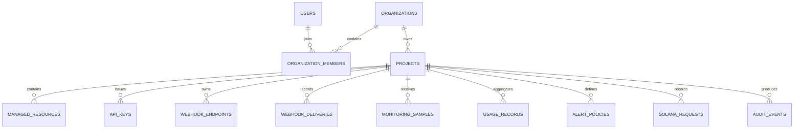

# SwanLab Architecture

## Purpose

SwanLab is structured as a control plane, not a provider clone. It stores configuration, authorization, project context, audit history, and observed operational records while delegating provider-specific work to server-side adapters. The architecture supports progressive activation: an unconfigured provider produces a declared state, while a configured provider can add live requests and telemetry without altering the UI tenancy model.

## Current Runtime and SvelteKit Target

The checked-in runtime is React + Vite + Express + tRPC. The requested SvelteKit architecture is a target migration path, not a claim about the present source tree. The migration preserves the following service boundaries:

| Responsibility            | Current location                           | SvelteKit target                               |
| ------------------------- | ------------------------------------------ | ---------------------------------------------- |
| Protected action boundary | `server/routers/swanlab.ts`                | `src/routes/**/+server.ts` and server actions. |
| Tenant authorization      | `server/db.ts` and protected procedures    | `src/lib/server/authz.ts`.                     |
| Provider clients          | `server/services/integrationStatus.ts`     | `src/lib/server/{database,solana,ai}`.         |
| Browser workspace state   | `client/src/contexts/WorkspaceContext.tsx` | `src/lib/stores/workspace.ts`.                 |

## Tenant Model

Every access path resolves in this order: authenticated identity → organization membership → project belongs to organization → role permits action. UI selection state is not authorization.

## Provider States

| State            | Meaning                                                        | UI treatment                                  |
| ---------------- | -------------------------------------------------------------- | --------------------------------------------- |
| `ready`          | Required configuration is present and a server test succeeded. | Present live status and records.              |
| `pending`        | Resource exists but provider verification has not completed.   | Show setup/verification action.               |
| `attention`      | Provider test or policy requires review.                       | Highlight the issue without exposing details. |
| `not_configured` | Required configuration was not supplied.                       | Show an explicit configuration requirement.   |

## Data Flow

1. A user selects an organization and project in the client shell.
2. A protected tRPC procedure receives the requested project identifiers.
3. The server performs membership and project-containment checks.
4. The procedure reads or changes data, emits audit records where relevant, and optionally calls an integration boundary.
5. The UI receives only safe metadata, derived status, or one-time secrets that are explicitly permitted.

## Scheduled Alert Activation

Alert policy storage and owner-delivery tests are implemented. Recurring execution is intentionally deferred until deployment because scheduled callbacks must target the published application. The production sequence is:

1. Publish the application.
2. Connect trusted telemetry sources.
3. Create a schedule that authenticates as a scheduled caller.
4. Look up alert policy by task UID, not browser-supplied body data.
5. Evaluate the rule idempotently and deliver only when the threshold is crossed.
